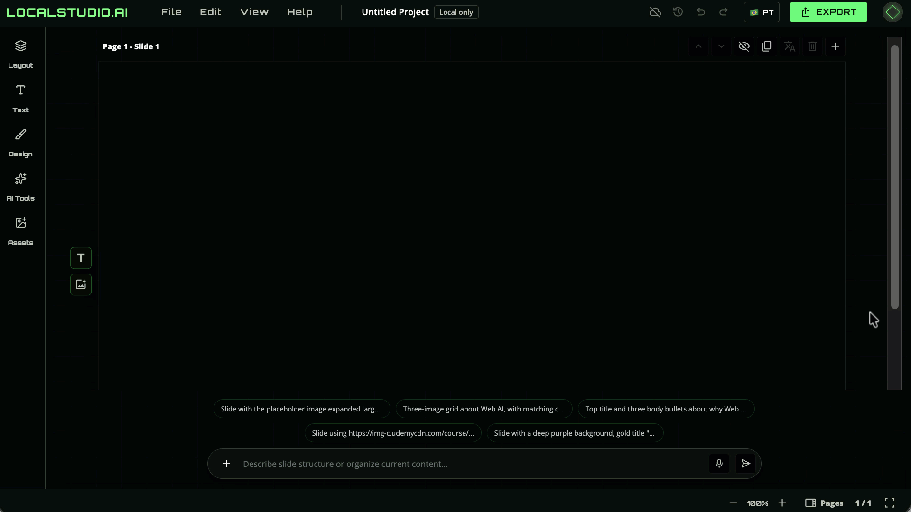
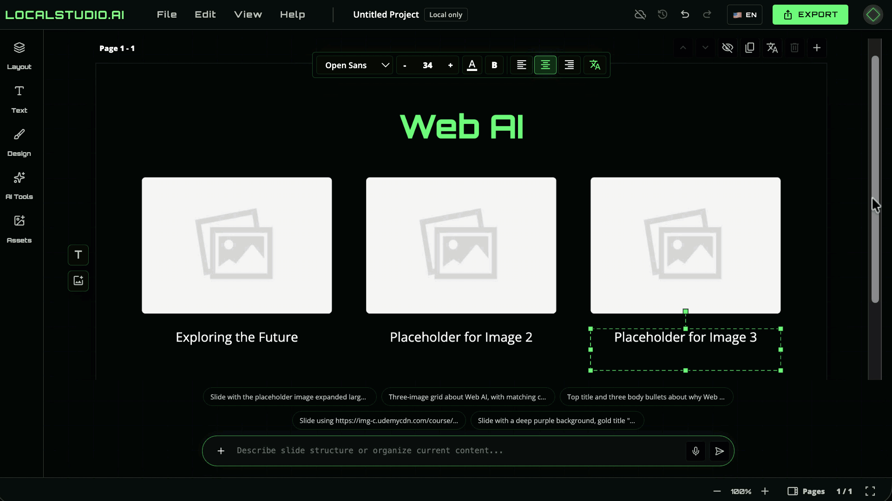
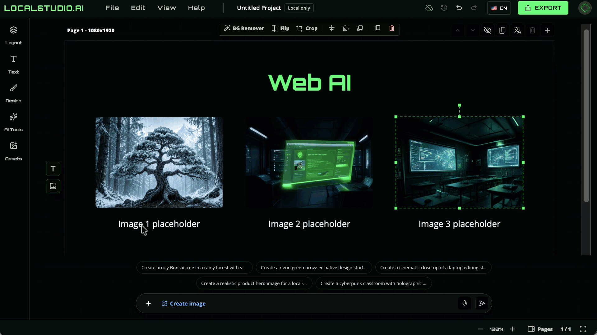
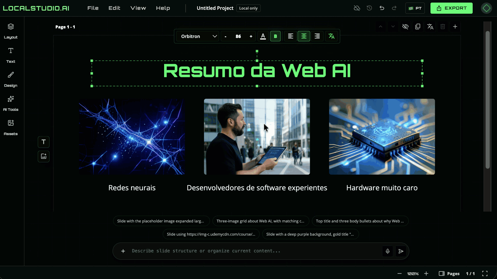

# LocalStudio.dev

[](https://github.com/ErickWendel/localstudio/actions/workflows/ci.yml)
[](https://github.com/ErickWendel/localstudio/actions/workflows/pages.yml)
[](LICENSE)


Browser-only Canva-style slides and image editing, powered by local Web AI.

[Live demo](https://erickwendel.github.io/localstudio/) · [Architecture](docs/ARCHITECTURE.md) · [Contributing](CONTRIBUTING.md)


## What It Does

LocalStudio.dev runs in the browser: compose slides, generate layouts, create image assets, translate text, edit images, save project history, and export designs without a backend.

| Prompt to slide | Prompt to image |
| --- | --- |
|  |  |

| Translate | Edit images |
| --- | --- |
|  |  |

| Web AI setup | Local project history |
| --- | --- |
|  |  |

## Quick Start

```bash
npm ci
npm run dev
```

Focused local apps:

```bash
npm run dev:landing
npm run dev:editor
```

Quality checks:

```bash
npm run lint
npm run typecheck
npm run test
npm run build
```

## Browser AI Stack

Some features need Chrome experimental APIs, WebGPU, browser-managed model caches, and local folder permissions.

- Chrome APIs: [Prompt API](https://developer.chrome.com/docs/ai/prompt-api), [Translator API](https://developer.chrome.com/docs/ai/translator-api), [Language Detector API](https://developer.chrome.com/docs/ai/language-detection)
- Hugging Face models: [Gemma 4 E2B](https://huggingface.co/onnx-community/gemma-4-E2B-it-ONNX), [TranslateGemma 4B](https://huggingface.co/onnx-community/translategemma-text-4b-it-ONNX), [XLM-RoBERTa language detection](https://huggingface.co/onnx-community/xlm-roberta-base-language-detection-ONNX), [SlimSAM](https://huggingface.co/Xenova/slimsam-77-uniform), [Bonsai Image 4B](https://huggingface.co/prism-ml/bonsai-image-ternary-4B-mlx-2bit)
- WebML references: [Bonsai Image WebGPU Space](https://huggingface.co/spaces/webml-community/bonsai-image-webgpu), [Hugging Face WebML community](https://huggingface.co/webml-community)

## Workspace

- `apps/landing`: product page at `/`
- `apps/editor`: Web AI editor at `/editor/`
- `packages/brand`: shared LocalStudio.dev tokens and CSS

## Roadmap

- More browser/device verification for WebGPU flows.
- Better model selection and generation history.
- Deeper export formats beyond PNG.
- More examples built with the editor.

## License

MIT. See [LICENSE](LICENSE).
