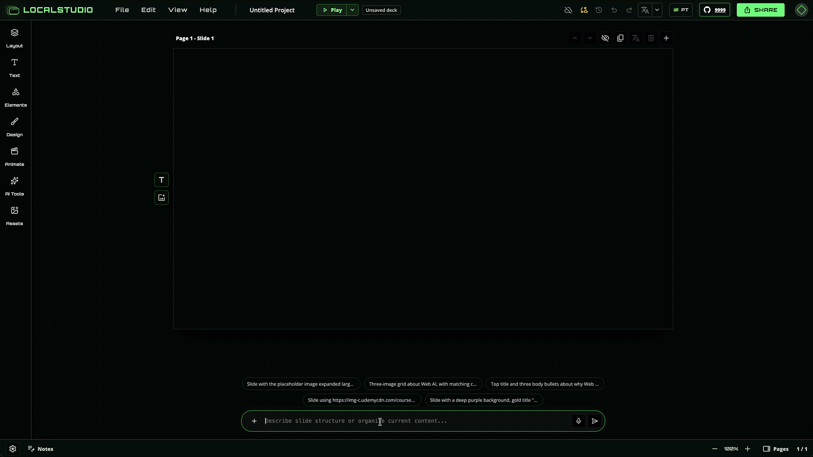
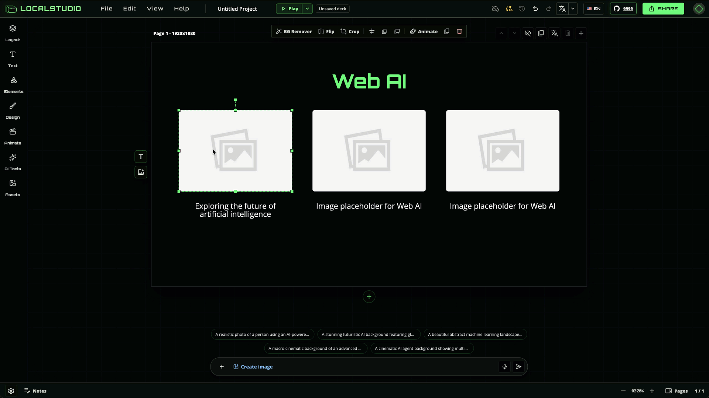
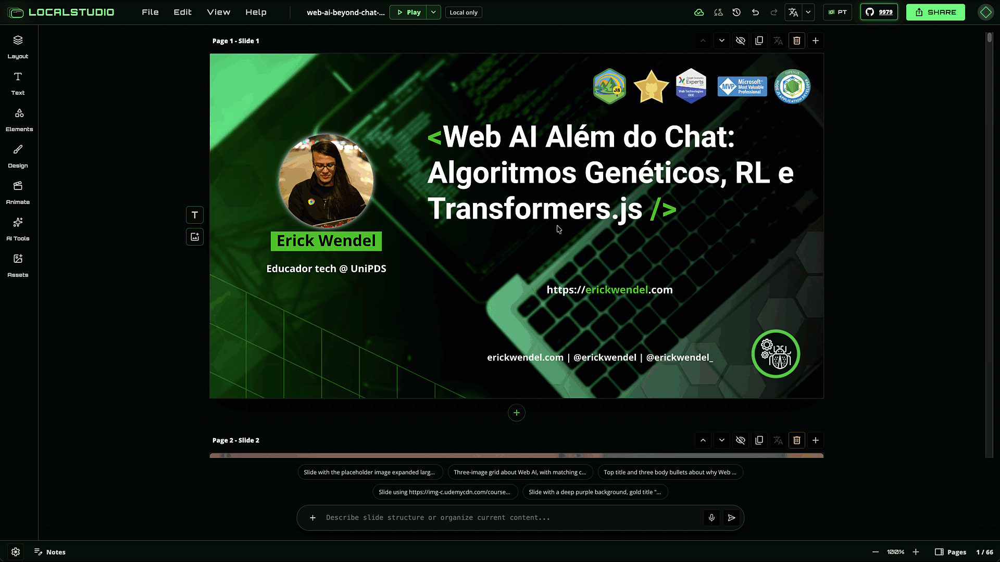
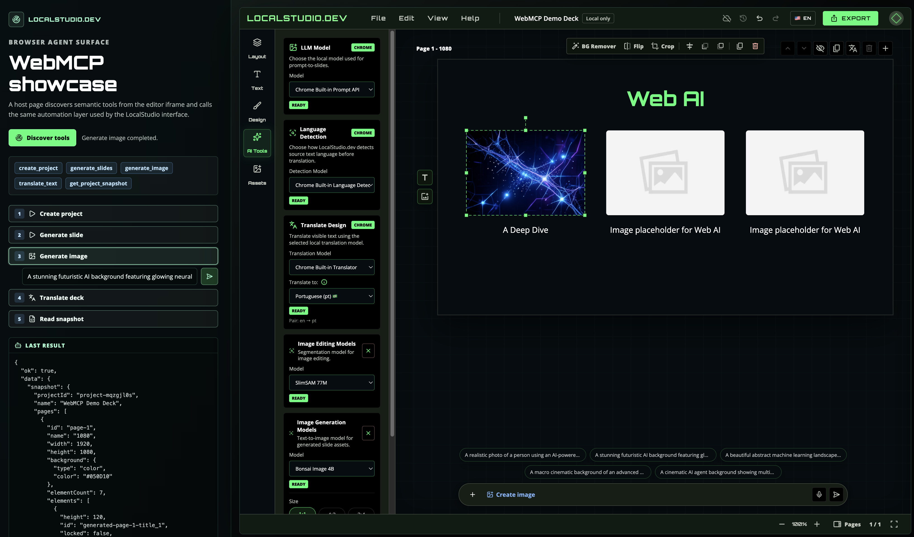

# LocalStudio.dev

[](https://github.com/ErickWendel/localstudio/actions/workflows/ci.yml)
[](https://erickwendel.github.io/localstudio/coverage/editor/)
[](https://erickwendel.github.io/localstudio/coverage/joystick/)
[](LICENSE)


Design slides with local AI, then keep editing.

LocalStudio.dev is a browser-native Canva-style editor that turns PowerPoint (`.pptx`) import, prompt generation, image
creation, translation, background removal, presenter-mode PWA remote control, local project history, and S3-compatible
projects into one editable slide workflow.

[Live demo](https://localstudio.dev/) · [Docs](https://localstudio.dev/docs/) · [WebMCP showcase](https://localstudio.dev/webmcp/) · [Architecture](docs/ARCHITECTURE.md) · [Contributing](CONTRIBUTING.md)

For usage walkthroughs, start with the hosted docs at [localstudio.dev/docs](https://localstudio.dev/docs/).

## About It

LocalStudio.dev runs in the browser without a product backend. Your deck remains a layered document: PowerPoint
(`.pptx`) files can become editable LocalStudio projects, prompts become editable slide objects, generated images stay
as normal assets, translated text updates in place, presenter controls can run from the companion PWA, and project files
can be saved to a local folder you control.

| Landing section | What it proves |
| --- | --- |
| Watch the workflow | Import, prompt, generate images, translate, save locally, present, and share. |
| Feature showcase | Every AI action returns to editable slide layers inside the same deck. |
| WebMCP Showcase | Host pages and agents can discover editor tools and drive the same local-first surface. |
| Requirements | Chrome-first browser APIs, WebGPU model caches, and local storage expectations. |



## Features

### Watch the workflow

The landing page now walks through the full LocalStudio loop with short product demos. Each step keeps the deck editable
instead of producing a locked screenshot.

| Workflow | Demo |
| --- | --- |
| Bring your own PPT |  |
| Prompt-to-slide |  |
| Prompt-to-image |  |
| Translate |  |
| Work locally |  |
| Present with confidence |  |
| Share your presentation |  |

### Feature showcase

The feature showcase on the landing page focuses on the editor outcomes behind those demos:

- PowerPoint (`.pptx`) import turns existing decks into editable LocalStudio projects.
- Presenter mode adds speaker notes, slide controls, fullscreen playback, and PWA remote control over peer-to-peer browser connections.
- Prompt-to-slide creates structured text, image, and shape layers instead of a flat bitmap.
- Prompt-to-image saves generated assets locally and drops them back onto the canvas as normal image layers.
- Translation supports selected text, the current page, or the whole deck with language detection and target-language control.
- Local project history keeps project JSON, assets, cache, and version snapshots in a folder you control.
- S3-compatible mirroring publishes project JSON, assets, version history, config, public share payloads, and mirrored fonts.
- Image editing supports click-guided segmentation, mask preview, flip, and crop after extraction.

### S3-compatible projects

Local projects can still publish public links. S3-compatible storage keeps viewer assets reachable while the editable
project starts on your machine. MinIO works as the local/self-hosted example, but the same project mirror shape fits AWS
S3, Cloudflare R2, or any compatible endpoint. Local fonts can be mirrored too, so shared decks keep their typography
for viewers.


Mirrored payloads include:

- Project JSON
- Referenced assets
- Version history
- Local config
- Public share payloads
- Mirrored fonts

Keys stay in this browser profile. Scope credentials to the bucket or prefix you intend to use.

## Web AI

Model choice is a product feature. LocalStudio uses Chrome built-in AI APIs when available and WebGPU models when users
need explicit control over the model behind each workflow.

- Chrome APIs: [Prompt API](https://developer.chrome.com/docs/ai/prompt-api), [Translator API](https://developer.chrome.com/docs/ai/translator-api), [Language Detector API](https://developer.chrome.com/docs/ai/language-detection)
- Hugging Face models: [Gemma 4 E2B](https://huggingface.co/onnx-community/gemma-4-E2B-it-ONNX), [TranslateGemma 4B](https://huggingface.co/onnx-community/translategemma-text-4b-it-ONNX), [XLM-RoBERTa language detection](https://huggingface.co/onnx-community/xlm-roberta-base-language-detection-ONNX), [SlimSAM](https://huggingface.co/Xenova/slimsam-77-uniform), [Bonsai Image 4B](https://huggingface.co/prism-ml/bonsai-image-ternary-4B-mlx-2bit)
- WebML references: [Bonsai Image WebGPU Space](https://huggingface.co/spaces/webml-community/bonsai-image-webgpu), [Hugging Face WebML community](https://huggingface.co/webml-community)


## WebMCP Showcase

WebMCP exposes LocalStudio actions as semantic browser tools, so an external page can discover capabilities, create a
project, generate assets, translate the deck, and read the resulting project snapshot.

- Tool discovery from the editor iframe
- Prompt, image, translate, and snapshot actions
- Same local-first editor surface behind every call

[Open the WebMCP showcase](https://localstudio.dev/webmcp/)



## Requirements

LocalStudio runs in the browser, but modern browser AI workflows still need the right local surface.

- Chrome browser is recommended for Chrome-first browser AI and file system APIs.
- At least 10GB free storage is recommended for model weights, browser-managed caches, generated assets, and local project history.
- Local folder permissions are required for project persistence flows.

## S3-Compatible Project Setup

Start the local MinIO stack:

```bash
docker compose -f docker-compose.minio.yml up
```

Default local settings:

- API endpoint: `http://localhost:9000`
- Console: `http://localhost:9001`
- Bucket: `localstudio`
- Access key: `localstudio`
- Secret key: `localstudio123`
- Region: `us-east-1`
- Public base URL: `http://localhost:9000/localstudio`
- Prefix: `mirrors`
- Path-style URLs: enabled

In the editor, open `Settings` -> `Mirror Settings` and enter those values. Use `File` -> `Mirror Now` to force an
upload, or `File` -> `Import Remote` on another computer to download a mirrored project into a new local folder and
continue syncing.

The dev compose file sets the `localstudio` bucket to public download mode so mirrored files can be shared through the
public base URL. For production, use a bucket or prefix policy that matches what you intend to publish. Browser-stored
keys are persisted locally, so avoid root credentials outside local development.

## Quick Start

```bash
npm ci
npm run dev
```

The dev server starts the landing, editor, and joystick apps together. Use the landing URL as the public entry point;
`/editor/` and `/joystick/` are proxied to the connected app servers.

Disable the editor onboarding tour during local testing with:

```bash
VITE_DISABLE_EDITOR_TOUR=true npm run dev
```

The tour is already disabled in the automated E2E server so tests do not need to close it before interacting with the
editor.

Quality checks:

```bash
npm run lint
npm run typecheck
npm run test
npm run test:e2e
npm run build
```

## Workspace

- `apps/landing`: product page at `/`
- `apps/editor`: Web AI editor at `/editor/`
- `apps/joystick`: presenter remote PWA at `/joystick/`
- `packages/brand`: shared LocalStudio.dev tokens and CSS

## Roadmap

- More browser/device verification for WebGPU flows.
- Better model selection and generation history.
- Deeper export formats beyond PNG.
- More examples built with the editor.

## License

MIT. See [LICENSE](LICENSE).
